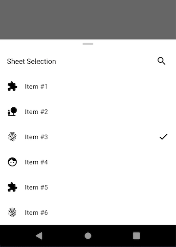

# Sheet Selection
[](https://jitpack.io/#minibugdev/SheetSelection)
[](https://raw.githubusercontent.com/minibugdev/DrawableBadge/master/LICENSE)

`SheetSelection` is an Android library for display list and be able to select the item as a [BottomSheet](https://developer.android.com/reference/com/google/android/material/bottomsheet/BottomSheetDialogFragment).


## Installation
Add it in your **root** `build.gradle` at the end of repositories:
``` groovy
repositories {
    ..
    maven { url 'https://jitpack.io' }
}
```
Add the dependency
``` groovy
dependencies {
    implementation 'com.github.minibugdev:sheetselection:0.0.1'
}
```

## How to use


``` kotlin
val items = listOf(
    SheetSelectionItem("1", "Item #1", R.drawable.ic_extension),
    SheetSelectionItem("2", "Item #2", R.drawable.ic_nature),
    SheetSelectionItem("3", "Item #3", R.drawable.ic_fingerprint),
    SheetSelectionItem("4", "Item #4", R.drawable.ic_face)
)

SheetSelection.Builder(context)
    .title("Sheet Selection")
    .items(items)
    .selectedPosition(2)
    .showDraggedIndicator(true)
    .searchEnabled(true)
    .onItemClickListener { item, position -> 
        // DO SOMETHING
    }
    .show()
```
#### Configurations
- Set title by `Builder.title(String)`. It will hide when set to `NULL` or **empty** string.
- Set items by `Builder.items(List<SheetSelectionItem>)`.
- Set selected item by `Builder.selectedPosition(Int)`. default is `SheetSelection.NO_SELECT`
- Show dragged indicator by `Builder.showDraggedIndicator(Boolean)`. default is `false`
- Set search enabled by `Builder.searchEnabled(Boolean)`. default is `false`
- Set custom theme by `Builder.theme(@StyleRes)`.
- To handle the item click listener by `Builder.onItemClickListener()`.

## Customize your own style


### 1.Define your theme and style
Add your theme and style to `styles.xml` or wherever you want.

**1. Title** text style `parent` must be `Widget.SheetSelection.Title` eg.
``` xml
<style name="Widget.Custom.SheetSelection.Title" parent="@style/Widget.SheetSelection.Title">
    <item name="android:textAppearance">@style/TextAppearance.MaterialComponents.Headline5</item>
    <item name="android:gravity">center</item>
</style>
```

**2. Item** text style `parent` must be `Widget.SheetSelection.Item` eg.
``` xml
<style name="Widget.Custom.SheetSelection.Item" parent="@style/Widget.SheetSelection.Item">
    <item name="android:textAppearance">@style/TextAppearance.MaterialComponents.Caption</item>
    <item name="drawableTint">@color/colorPrimary</item>
</style>
```

**3. Indicator** style `parent` must be `Widget.SheetSelection.Indicator` eg.
``` xml
<style name="Widget.Custom.SheetSelection.Indicator" parent="@style/Widget.SheetSelection.Indicator">
    <item name="android:layout_marginTop">48dp</item>
</style>
```

Finally, override SheetSelection attributes by setting your styles to your **Theme** (`parent` must be `Theme.SheetSelection`)
``` xml
<!-- Customize SheetSelection theme -->
<style name="Theme.Custom.SheetSelection" parent="@style/Theme.SheetSelection">
    <item name="sheetSelection_titleStyle">@style/Widget.Custom.SheetSelection.Title</item>
    <item name="sheetSelection_itemStyle">@style/Widget.Custom.SheetSelection.Item</item>
    <item name="sheetSelection_indicatorStyle">@style/Widget.Custom.SheetSelection.Indicator</item>
    <item name="sheetSelection_indicatorColor">@color/colorAccent</item>
</style>
```

### 2. Apply your Theme to SheetSelection
``` kotlin
SheetSelection.Builder(this)
    .theme(R.style.Theme_Custom_SheetSelection)
    ..
    .show()
```

## License
```
MIT License

Copyright (c) 2020 Teeranai.P

Permission is hereby granted, free of charge, to any person obtaining a copy
of this software and associated documentation files (the "Software"), to deal
in the Software without restriction, including without limitation the rights
to use, copy, modify, merge, publish, distribute, sublicense, and/or sell
copies of the Software, and to permit persons to whom the Software is
furnished to do so, subject to the following conditions:

The above copyright notice and this permission notice shall be included in all
copies or substantial portions of the Software.

THE SOFTWARE IS PROVIDED "AS IS", WITHOUT WARRANTY OF ANY KIND, EXPRESS OR
IMPLIED, INCLUDING BUT NOT LIMITED TO THE WARRANTIES OF MERCHANTABILITY,
FITNESS FOR A PARTICULAR PURPOSE AND NONINFRINGEMENT. IN NO EVENT SHALL THE
AUTHORS OR COPYRIGHT HOLDERS BE LIABLE FOR ANY CLAIM, DAMAGES OR OTHER
LIABILITY, WHETHER IN AN ACTION OF CONTRACT, TORT OR OTHERWISE, ARISING FROM,
OUT OF OR IN CONNECTION WITH THE SOFTWARE OR THE USE OR OTHER DEALINGS IN THE
SOFTWARE.
```
